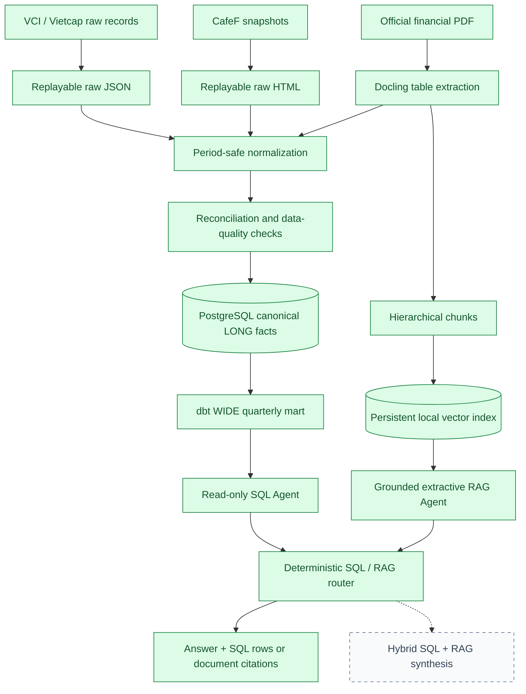

# FinSight VN

FinSight VN is a financial intelligence platform for Vietnamese listed companies. It is being built around two complementary kinds of research: structured financial analysis over canonical facts, and evidence-grounded answers from official financial documents.

The current repository implements two local end-to-end paths: a structured SQL branch over canonical financial facts and a document RAG branch over an official FPT financial report. A deterministic router exposes both through one CLI while keeping generated SQL and document citations visible.

## Why FinSight?

Financial research questions do not all belong in the same system:

```text
Structured question                         Document question
"How did FPT revenue change?"               "What risks did management discuss?"
             |                                             |
             v                                             v
      SQL / analytics                               Document retrieval
```

FinSight's goal is to provide one interface over both paths while keeping every answer traceable to validated data or source documents. A trustworthy "data unavailable" result is preferable to a plausible value produced from a missing or mislabeled period.

## Architecture

Green components are implemented; dashed components are planned.



The RAG branch processes the 46-page FPT 2024Q2 consolidated financial report. Docling OCR output is cached, tables remain standalone chunks with section context, and the persistent local index allows subsequent demos to start without repeating OCR.

## What It Can Do Today

- Backfill quarterly Income Statement, Balance Sheet, and Cash Flow metrics from CafeF and VCI-backed Vnstock sources.
- Backfill annual statements through a separate annual contract so annual values cannot silently enter quarterly facts.
- Retain raw provider responses and acquisition metadata for replay and audit.
- Normalize provider-specific fields into canonical financial records with source references and ingestion timestamps.
- Reconcile sources, surface material conflicts, and use an official extraction when one is available.
- Detect missing quarters and validate `Assets = Liabilities + Equity` within an explicit tolerance.
- Upsert canonical facts and quality issues into PostgreSQL without duplicating their natural keys.
- Build a tested wide quarterly mart with margins and YoY growth metrics.
- Translate supported natural-language questions into validated, read-only SQL and return the SQL, rows, and a concise answer.
- Extract a structured Income Statement candidate from an official PDF with confidence and ambiguity checks.
- Build deterministic, metadata-rich document chunks from Docling headings, paragraphs, and tables.
- Retrieve cited evidence from a persistent local hashing-vector index.
- Route structured questions to SQL and document questions to RAG without requiring an LLM router.
- Refuse document answers when the indexed evidence is insufficient.

## Engineering Highlights

### Period-safe financial ingestion

An ingestion investigation exposed a dangerous class of bug: values from a long-to-wide provider response could become detached from their fiscal-quarter labels when positional columns were trusted.

The VCI normalization path now preserves the upstream `(yearReport, lengthReport)` pair beside every value, rejects annual rows from the quarterly pipeline, and keys each fact by:

```text
symbol + fiscal_year + fiscal_quarter + metric
```

Regression tests deliberately shuffle source rows and verify that every value remains attached to its original period.

This change followed a reconciliation audit that initially found 63 CafeF/VCI historical conflicts. The upstream VCI rows carried correct explicit periods, but a report-shaped transformation had associated values with incorrect column labels. Preserving `(yearReport, lengthReport)` eliminated 61 of those conflicts; the remaining differences were left for source-level investigation rather than assumed to be errors.

### Metric-level data quality

For regular companies, the quarterly VCI mapping covers 11 canonical metrics across three statements:

```text
Income Statement: revenue, gross profit, operating profit, net profit
Balance Sheet:    cash, total assets, total liabilities, equity
Cash Flow:        operating, investing, and financing cash flow
```

Quality conditions are stored as data rather than hidden in logs. Implemented checks include missing-period detection, cross-source conflicts, quarterly/annual separation, natural-key uniqueness through warehouse constraints, and the balance-sheet identity.

The audited MVP scope is:

```text
4 regular companies x 26 quarters x 11 metrics = 1,144 observations
```

All 1,144 expected observations were present in the audited raw VCI scope. Completeness does **not** mean that every reported value has been independently verified for financial accuracy.

### Replayability and provenance

Provider responses are saved before downstream use. Canonical records retain `source`, `source_reference`, and `ingested_at`, while raw CafeF snapshots include the request period, source URL, acquisition time, and SHA-256 digest. Parser fixes can therefore be replayed without silently losing the original evidence.

### Official-report fallback

The FPT 2024Q2 path demonstrates the intended fallback:

```text
Structured-source gap or conflict
              |
              v
       Official financial PDF
              |
              v
     Docling table extraction
              |
              v
   Strict structured normalization
              |
              v
        Source reconciliation
```

The extractor preserves raw labels, statement codes, notes, units, reporting columns, extraction method, and timestamp. It fails explicitly when no table clears the confidence threshold or when the best candidate is ambiguous.

### Version-aware financial facts — in progress

Financial statements can be revised after their first publication, and reviewed filings can reclassify line items. The current warehouse keeps one current fact per natural key; immutable fact versions and a separate trusted-current view have not been implemented yet.

The intended model is:

```text
Raw sources -> versioned canonical facts -> trusted current view -> analytical marts
```

## Audited Repository Snapshot

The canonical artifacts in the audited local workspace currently contain:

| Scope | Coverage |
| --- | --- |
| SQL MVP companies | FPT, HPG, MWG, VNM |
| Audited quarterly facts | 1,144 canonical metric records |
| Quarterly MVP range | 2020Q1–2026Q2 (26 quarters) |
| dbt mart | 104 company-quarter rows |
| Annual artifacts | 509 canonical metric records |
| Annual period range | 2016–2025 |
| Automated tests | 55 passing Python tests + 21 passing dbt resources/tests |

FPT, MWG, HPG, and VNM expose the full 11-metric regular-company quarterly mapping in the current artifacts. VCB ingestion exists outside the SQL MVP but uses a smaller bank-specific taxonomy; broader bank and securities-company taxonomies remain work in progress.

## Data Pipeline

```text
Provider request
      |
      v
Raw snapshot + metadata
      |
      v
Provider-aware parser
      |
      v
Canonical contract
      |
      v
Reconciliation + quality checks
      |
      +------------------+
      v                  v
Canonical JSONL       PostgreSQL LONG facts
                         |
                         v
                    dbt WIDE mart
                         |
                         v
                  Read-only SQL Agent
```

Quarterly and annual facts have deliberately different contracts and tables:

- Quarterly grain: `symbol + fiscal_year + fiscal_quarter + metric`
- Annual grain: `symbol + fiscal_year + statement_type + metric`

## RAG Pipeline

```text
Official PDF
    ↓
Docling OCR + structural extraction
    ↓
Content-addressed JSON cache
    ↓
Hierarchical chunks
    ├── headings
    ├── paragraphs grouped by page/section
    └── standalone tables with section context
    ↓
Persistent local hashing-vector index
    ↓
Filtered top-k retrieval
    ↓
Grounded extractive answer + page/section/chunk citations
```

The first indexed document is FPT's 46-page consolidated financial report for 2024Q2. It produces 597 structured elements and 349 chunks. Each chunk retains `document_id`, symbol, reporting period, one-based PDF page, section, chunk type, parent section reference, and source path.

The MVP uses a dependency-free sparse hashing-vector index with corpus IDF weighting and lightweight query expansion. It is fast, deterministic, serializable to JSON, and sufficient for measuring a first local baseline. It is not presented as a production-grade semantic embedding model. Tables receive retrieval context from their section and are kept intact rather than split by raw character count.

Answer generation is deliberately extractive: FinSight returns only retrieved report passages and their citations. A score plus lexical-grounding gate distinguishes absent evidence from negative evidence; unsupported questions return an explicit insufficient-evidence response with no citations.

## Query Routing

The deterministic router keeps tool choice visible and replaceable:

```text
"What was FPT revenue in 2025Q4?"                 → SQL
"What did FPT report about short-term loans?"     → RAG
```

Questions combining a structured calculation and management explanation are classified as `HYBRID` and rejected with an actionable message. Hybrid synthesis is intentionally future work rather than a hidden or simulated capability.

## Tech Stack

| Area | Implemented |
| --- | --- |
| Data engineering | Python, Pandas, Requests |
| Storage and analytics | PostgreSQL, dbt, JSON Lines, local raw snapshots |
| Financial sources | CafeF, VCI/Vietcap through Vnstock, official filings |
| Document intelligence | Docling OCR and structural extraction |
| Retrieval | Persistent sparse hashing-vector index with IDF weighting |
| Query interface | Deterministic router, SQL templates, grounded extractive RAG, psycopg |
| Quality | pytest, reconciliation, completeness checks, accounting invariants |
| Local infrastructure | Docker Compose |

Planned or being explored: a stronger multilingual embedding model, optional LLM synthesis, hybrid SQL/RAG questions, Airflow, LangGraph, Redis, Kafka, and Flink. They are not represented here as implemented dependencies.

## Current Status

**Implemented**

- [x] Configurable five-company universe
- [x] Replayable quarterly and annual financial ingestion
- [x] Period-safe VCI normalization
- [x] Income Statement, Balance Sheet, and Cash Flow normalization
- [x] Multi-source reconciliation and official-report fallback
- [x] Completeness and balance-sheet identity checks
- [x] Idempotent PostgreSQL loading
- [x] dbt staging model, quarterly analytical mart, and 21 passing checks
- [x] Read-only SQL Agent with approved-relation enforcement and query timeout
- [x] Verified answers for all seven representative demo questions
- [x] Initial Docling-based Income Statement extraction
- [x] Cached full-document Docling extraction for one official FPT report
- [x] Structure-aware chunks with deterministic IDs and citation metadata
- [x] Persistent local retrieval index and configurable top-k retrieval
- [x] Grounded extractive RAG answers with insufficient-evidence handling
- [x] Unified deterministic SQL/RAG router and CLI
- [x] Ten-question retrieval/RAG evaluation baseline
- [x] Unit and integration-style tests for the current ingestion slice

**In progress**

- [ ] Version-aware canonical financial facts
- [ ] Broader bank-specific and securities-company taxonomies
- [ ] Generalized official-document acquisition and parsing
- [ ] Stronger multilingual semantic embeddings and optional LLM synthesis
- [ ] Hybrid SQL + RAG answers

**Planned**

- [ ] Market-data ingestion and realtime serving
- [ ] Airflow orchestration, CI/CD, and production deployment

## Repository Structure

```text
finsight_vn/              contracts, ingestion, DQ, warehouse, and SQL Agent
dbt/                      staging model, quarterly mart, macros, and data tests
evaluation/               small answerable/unanswerable RAG baseline set
scripts/                  backfill, RAG build/eval, question CLI, and demo
tests/                    ingestion, SQL safety, PDF, retrieval, citation, router tests
config/companies.yaml     configured company universe and annual date range
data/raw/                 replayable provider snapshots (git-ignored)
data/canonical/           canonical JSONL outputs (git-ignored)
data/extracted/           structured official-PDF extraction (git-ignored)
compose.yaml              local PostgreSQL service
doc/MASTER_SPEC.md        target architecture and phased engineering plan
```

## Getting Started

Requirements: Python 3.10+, Docker, and a Vnstock API key for the VCI-backed path.

### 1. Create the environment

```powershell
python -m venv .venv
.\.venv\Scripts\Activate.ps1
python -m pip install --upgrade pip
python -m pip install -r requirements.txt "vnstock>=4.0.6"
```

### 2. Configure local secrets

Copy `.env.example` to `.env` and `.env.postgres`, then replace the placeholder password and add `VNSTOCK_API_KEY` to `.env`. These files are git-ignored; do not commit credentials.

### 3. Start PostgreSQL

```powershell
docker compose up -d postgres
```

The default example configuration exposes PostgreSQL on `localhost:5433`.

### 4. Run the quarterly backfill

```powershell
python -m scripts.backfill_quarterly `
  --symbols FPT MWG VNM HPG VCB `
  --start 2016Q1 `
  --end 2026Q2 `
  --official-fpt-json data\extracted\fpt_2024q2_income_statement_raw.json
```

### 5. Run the annual backfill

```powershell
python -m scripts.backfill_annual `
  --symbols FPT MWG VNM HPG VCB `
  --start-year 2016 `
  --end-year 2025
```

### 6. Run the tests

```powershell
python -m pytest -q
```

### 7. Build and test the analytical mart

```powershell
.\scripts\dbt.ps1 build
```

This creates `staging.stg_financial_statement` and `analytics.mart_regular_company_quarterly`, then runs schema, uniqueness, nullability, accepted-value, and accounting-identity checks.

### 8. Build the local RAG index

```powershell
python -m scripts.build_rag `
  data\official\fpt_bctc_hop_nhat_q2_2024.pdf `
  --symbol FPT `
  --period 2024Q2
```

The first run performs Docling OCR and can take several minutes. Later runs reuse `data/parsed/fpt_2024q2.json` only when both the PDF SHA-256 and the complete OCR configuration fingerprint match. Parsed content, chunks, and the index live under git-ignored `data/` paths.

### 9. Ask a question or run the unified demo

```powershell
python -m scripts.ask --question "What was FPT revenue in 2025Q4?"
python -m scripts.ask --question "Các khoản vay ngắn hạn của FPT được thực hiện theo hình thức nào?" --debug
python -m scripts.demo
```

The command displays the natural-language answer, generated SQL, and result rows. The SQL layer permits only a single `SELECT`/`WITH` statement against the approved mart, blocks mutation/DDL keywords and comments, applies a five-second timeout, caps fetched rows, and opens the transaction as read-only.

For RAG questions it displays `Route: RAG`, an evidence-grounded response, and citations containing the company, report period, PDF page, section, and chunk ID.

### 10. Run the RAG evaluation

```powershell
python -m scripts.evaluate_rag
python -m scripts.evaluate_rag --questions evaluation/rag_questions_vi.json
python -m scripts.evaluate_ocr
```

Provider availability and report publication dates change over time. Set the requested end period to the latest period you expect the upstream source to provide; missing periods are surfaced as quality issues rather than filled with zeroes.

## Verified Demo

These questions were executed against the PostgreSQL mart after the current backfill and dbt build:

| Question | Verified result |
| --- | --- |
| What was FPT revenue in 2025Q4? | VND 20,225,449,892,881 |
| Compare FPT revenue in 2024Q4 and 2025Q4. | VND 17,607,817,805,891 vs. VND 20,225,449,892,881 |
| How much did FPT net profit grow YoY in 2025Q4? | 19.76% |
| What was FPT gross margin in 2025Q4? | 34.84% |
| Compare revenue growth for FPT, HPG, MWG and VNM in 2025Q4. | HPG 33.88%, MWG 22.41%, FPT 14.87%, VNM 10.06% |

Verified document questions:

| Question | Retrieved evidence |
| --- | --- |
| Các khoản vay ngắn hạn của FPT được thực hiện theo hình thức nào? | Primarily unsecured facilities and letters of credit, drawable in VND or USD — physical PDF page 34, `23. VAY VÀ NỢ THUÊ TÀI CHÍNH` |
| FPT giải thích nguyên nhân tăng trưởng quý 2 năm 2024 như thế nào? | Technology segment growth, including overseas IT services and Japan/APAC momentum — physical PDF page 9 |
| FPT kiểm soát Công ty Cổ phần Viễn thông FPT như thế nào? | 45.66% ownership/voting interest plus majority board voting rights — physical PDF page 30, `16. ĐẦU TƯ VÀO CÔNG TY CON` |
| FPT có thảo luận rủi ro an ninh mạng không? | Insufficient evidence; no citation returned |

Example generated SQL:

```sql
SELECT symbol, period, net_profit, net_profit_yoy_growth
FROM analytics.mart_regular_company_quarterly
WHERE symbol = 'FPT' AND period = '2025Q4'
```

Values come from the current provider snapshot and should be interpreted with the source and reporting-version caveats described above; they are not hard-coded in the agent.

## Evaluation

The baseline contains ten questions derived from the indexed report: eight answerable cases spanning policies, notes, segment tables, growth explanation, loans, and related parties, plus two intentionally unsupported questions.

```text
Retrieval@5:       10/10
Grounded behavior: 10/10
Citation support:  10/10
```

For answerable cases, the evaluator checks that expected evidence appears in top-k, that the answer passes the grounding gate, and that the cited chunk contains supporting evidence. For unanswerable cases, it checks that FinSight declines to answer and returns no citation. This is a small project-specific baseline, not a claim of general RAG accuracy.

### OCR audit

The production profile is Docling + RapidOCR (`torch`, PP-OCRv6 small detection/recognition). On the manually verified six-region sample, production RapidOCR measured 7.63% CER and 42.94% WER while preserving all 26 selected financial numbers and all three sampled table shapes. FinSight prioritizes preservation of financial numbers and downstream retrieval/citation reliability over a lower general text error rate.

EasyOCR with explicit `vi,en` language support and the hybrid EasyOCR/RapidOCR profile are experimental benchmarks only. They materially reduced text CER/WER but corrupted or omitted financial numbers; the hybrid also increased full-report extraction from 122.81 seconds to 398.40 seconds and regressed the unchanged ten-question RAG evaluation. They are not production dependencies. The experimental CLI profiles fail with an actionable message when optional EasyOCR is unavailable.

Extraction cache identity includes the PDF SHA-256, complete OCR profile/options, page-numbering schema, and installed versions of Docling, docling-core, RapidOCR, Torch, plus EasyOCR for experimental profiles. The installed stack does not expose a reliable immutable OCR model checksum, so model files are not hashed on every startup; the explicit RapidOCR backend and PP-OCR model family remain documented here as the strongest stable model identity available.

## Engineering Decisions

- **Reliability before AI:** build a trustworthy historical foundation before adding an agent interface.
- **Missing is not zero:** unavailable periods remain explicit quality conditions.
- **Provider schemas stop at adapters:** downstream consumers use canonical names, not provider-specific fields.
- **Raw VCI records, not report-shaped columns:** explicit period identifiers stay attached to their values.
- **LONG facts, WIDE marts:** long storage keeps the canonical model extensible; the wide dbt mart makes ordinary analytical SQL simple and safe.
- **Company-type taxonomies:** regular-company metrics are supported without pretending bank or securities statements share identical semantics.
- **Provenance is part of the record:** source and source reference travel with every canonical fact.
- **Deterministic calculations stay deterministic:** growth, margins, and ratios belong in SQL/dbt or application code, not in an LLM prompt.
- **Infrastructure must earn its place:** Kafka, Flink, and Redis remain optional until a measured realtime workload requires them.

## Roadmap

1. Add version-aware immutable financial facts and a trusted-current view.
2. Strengthen official-filing validation and document provenance.
3. Expand bank and securities-company metric taxonomies.
4. Generalize document parsing, chunking, retrieval, and citation evaluation.
5. Add a SQL/RAG router only after the RAG branch works end-to-end.
6. Add deployment automation; consider realtime infrastructure only when a measured workload justifies it.

The full phased design and acceptance criteria are documented in [`doc/MASTER_SPEC.md`](doc/MASTER_SPEC.md).
